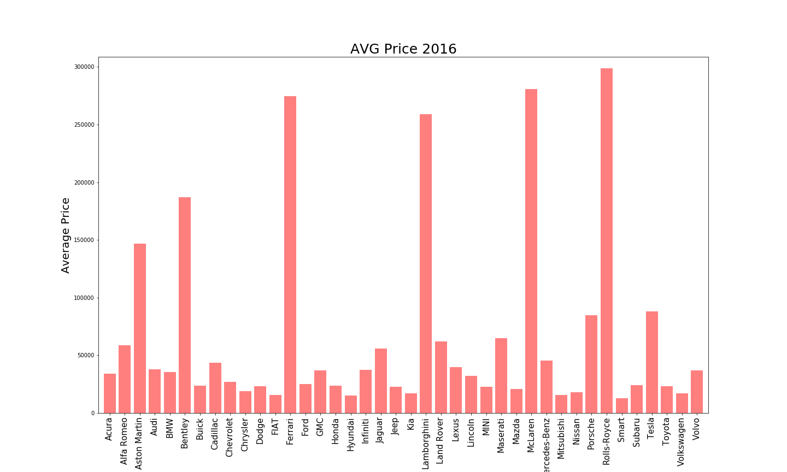

# Average price of each car brand manufactured in 2015, 2016 and 2017 years

We used 2 data's stored both in:
### 1) https://www.kaggle.com/CooperUnion/cardataset 
### 2) https://www.kaggle.com/jpayne/852k-used-car-listings#tc20171021.csv

We used Python (jupyter notebook) - for cleaning and SQL (pgAdmin 4) - to store and provide final result

## Our goal was ETL - EXTRACT, TRANSFORM and LOAD!

WE decided to represent every make of the car manufactured in 2015, 2016 and 2017 years and their average price.

Results we obtained are relevant for 2018!

## List of each car brand and average price for 2015, 2016 and 2017 years of manufacture!

## Average price of each auto brand manufactured in 2015 year!

## Average price of each auto brand manufactured in 2016 year!

## Average price of each auto brand manufactured in 2017 year!

## Average price of each auto brand manufactured in 2015, 2016 and 2017 years!

